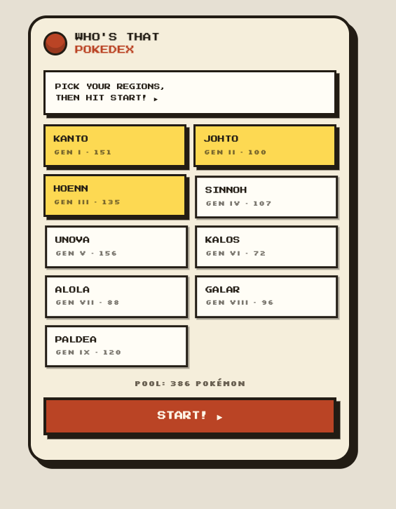
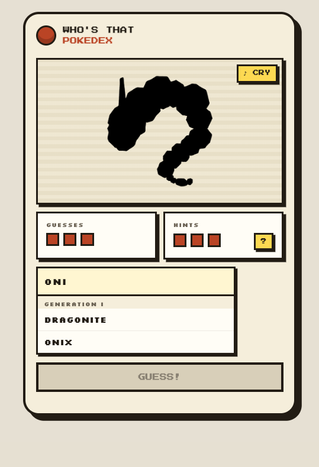
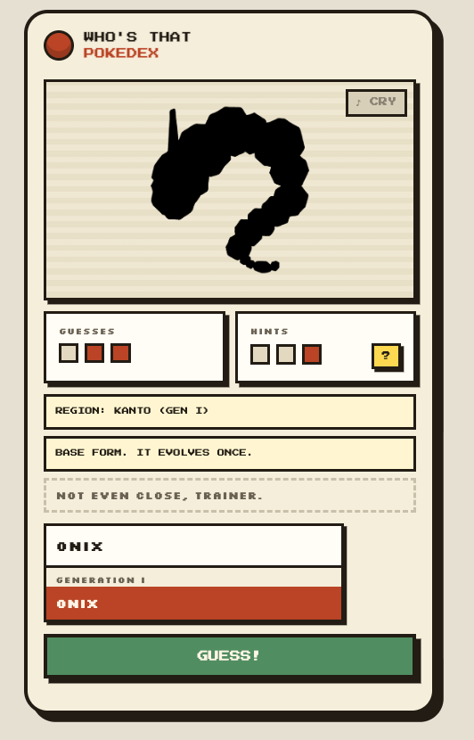
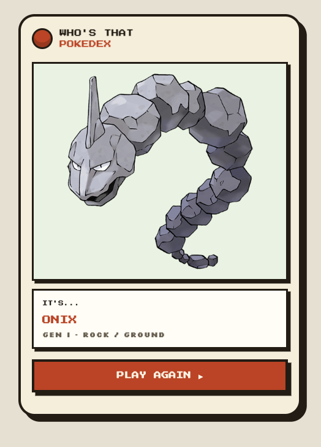

# WhosThatPokedex

I started out making a Console pokedex app so I could apply the things I've been learning in "Concurrency in C# Cookbook (2nd Edition)" by Stephen Cleary, but then I had the idea to turn this into a version of the "Who's That Pokemon?" guessing game since I was already working with those API endpoints and the relevant pokemon data. I wrote everything in the Core project and had Claude help me with the Web project by writing a simple Blazor app as well as making the UI with Claude Design so I could bring this to life over the weekend. This was built against [PokéAPI](https://pokeapi.co/).

## Screenshots

| | |
|---|---|
|  |  |
|  |  |

## Structure

- `src/WhosThatPokedex.Core` — `PokeApiClient` and all concurrency/fetching logic. No UI dependencies.
- `src/WhosThatPokedex.Web` — the actual game, a Blazor Server app.
- `src/WhosThatPokedex.Console` — thin console harness used while building out `PokeApiClient`; not the game.
- `tests/WhosThatPokedex.Core.Tests` — xUnit test project (currently just the scaffold stub).

## The game

Pick one or more generations, get shown a silhouette of a random Pokémon from the combined pool, and
guess who it is in 3 tries.

- **"Cartridge" visual theme** — pixel fonts (Press Start 2P / Silkscreen), chunky black borders, hard
  offset shadows instead of blur, styled after a GBA-era game screen. Adapted from a mobile mockup made
  with Claude Design.
- Multi-select generation picker (at least one required) shown as toggleable region cards; selected
  generations are fetched **concurrently** and merged into one pool
- Silhouette via a CSS `brightness(0)` filter on the official artwork — revealed on a correct guess or
  after 3 misses
- **Searchable guess picker** (`PokemonPicker`) — the full grouped list is always browsable, and typing
  narrows it live, so you never need to know a Pokémon's exact (sometimes odd) spelling
- Guesses and hints each shown as a row of 3 dots that fade as they're used (shared `TierDots` component)
- 3-tier hint system: region/generation, evolution stage (base/mid-evolution/fully evolved — derived by
  walking PokéAPI's evolution-chain tree), then type(s)
- "Hear its call" — plays the Pokémon's cry via a small JS interop call, with a cancellation-safe 5-second
  cooldown (a stale cooldown timer can't clear a newer one if you start a new game mid-cooldown)
- A few taunts on a wrong-but-not-final guess, just for personality

## Concurrency patterns in `PokeApiClient`

`GetPokemonForGenerationAsync(generationId, progress, cancellationToken)` fetches a generation's species
list, then fans out to fetch every Pokémon in it concurrently. Along the way it applies:

- **`async`/`await`** fundamentals, `IHttpClientFactory` via a typed client
- **`Task.WhenEach`** to process each Pokémon as its fetch completes, instead of waiting on the whole
  batch (`Task.WhenAll`) and losing everything if one request fails
- **`SemaphoreSlim`** to cap concurrent requests (max 10) instead of firing all ~150 at once
- **Per-item error handling** (`PokemonFetchOutcome`) — one failed Pokémon doesn't take down the rest;
  results come back as successes + a list of failures, not all-or-nothing
- **`IProgress<T>`** to report fetch progress back to the caller — the game's loading screen shows a real
  percentage driven by this, aggregated across every generation being fetched concurrently
- **`CancellationToken`**, threaded all the way down to the HTTP calls and the semaphore wait
- **Cache-stampede-safe caching** of generation results (`ConcurrentDictionary<int, Lazy<Task<T>>>`),
  with eviction on failure so a transient error doesn't get permanently cached
- **`Task.WhenAll`** fans out across *selected generations* in the UI layer — deliberately all-or-nothing,
  since a silently incomplete pool would be a correctness bug, not a graceful degradation. If it fails,
  the game shows an error and returns to the picker instead of leaving an unhandled exception to crash
  the Blazor Server circuit

## Running it

```bash
dotnet run --project src/WhosThatPokedex.Web
```

Opens a local URL — the console harness (`dotnet run --project src/WhosThatPokedex.Console`) still works
too, but just exercises `PokeApiClient` directly with no game UI.

## Testing

```bash
dotnet test
```

## TODO

- [ ] Write real unit tests for `PokeApiClient` (throttling, per-item failure handling, progress
      reporting, cancellation, caching) — currently untested beyond manual runs
- [ ] Deploy it somewhere so friends can actually play — looked at Azure App Service (Free F1) and
      Render; holding off for now (F1 needs a card on file and can hard-stop mid-session if a shared
      60 CPU-min/day quota is exceeded; Render is card-free but needs a Dockerfile since .NET isn't a
      native runtime there)
